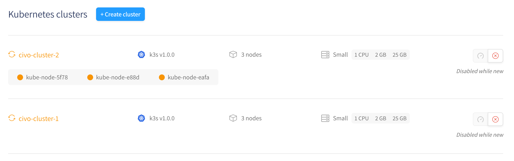
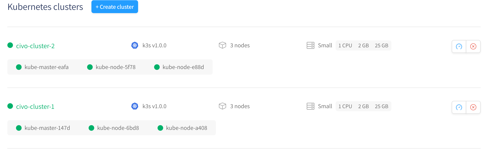
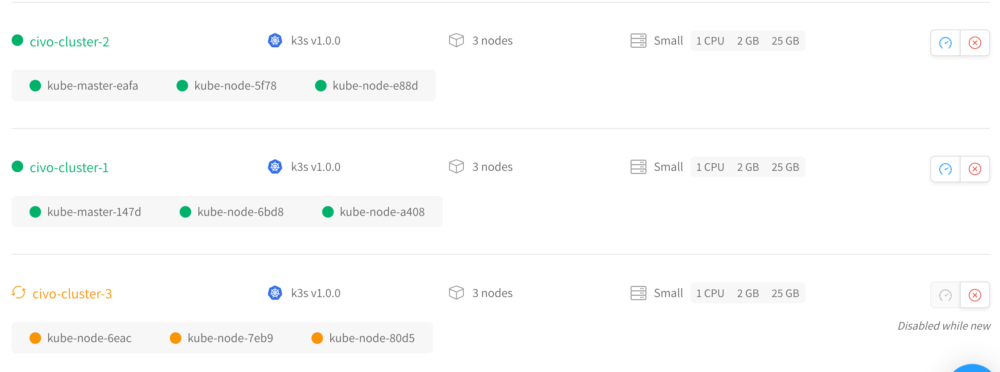

# Using Civoctl to declaratively manage your Kubernetes clusters

## Introduction

Just what is "infrastructure as code"? You may have read the phrase in conjunction with cloud-native development, but like many buzzwords of today its specific meaning may have eluded you. Don't worry, we're about to go through a practical example of what the idea entails.

This guide looks at the concept of infrastructure as code through the lens of a little tool to manage your Kubernetes clusters on Civo. Written by Civo user Gabe Duke, this tool, `civoctl` simply monitors a particular file for changes and uses the Civo API on your behalf. Creating a cluster is as simple as adding two lines to your file. By following this guide, you will download and set up `civoctl` and use it to both start and stop Kubernetes clusters on your account.

Gabe has a run-through screencast video [here](https://asciinema.org/a/8E4xO0YhHSt3BEbXbbEuZxGxL), in case you prefer that format to a written guide. Either way, we hope `civoctl` is fun, educational and maybe even useful!

## Getting Started: Civo account

To follow along with this guide, you will need a Civo account with access to our managed Kubernetes service. You can [sign up to trial the service here](https://www.civo.com/kube100), and while our beta period is running, get $70 discounted from your monthly invoice - enough to run a three-node Kubernetes cluster for a month!

Once you have signed up to Civo, you will need to find your API key. If you are logged in, this will be visible on the [main Civo API page](https://www.civo.com/api).

## Getting Started: Civo CLI (optional)

The easiest way for you to monitor what `civoctl` is doing in your account is to use the command-line tool for Civo, as you can set it to poll the API every few seconds and print the status to the screen. Though this is optional in the sense that `civoctl` does not require Civo CLI to be installed, this guide does use it on occasion alongside the web interface.

## Getting Started: Downloading civoctl and associating your Civo API key

You will need to have `go` set up on your machine. On a Mac, I would recommend getting it using [Homebrew](https://brew.sh/) by running `brew install go`. On a Linux system you will be able to get a Go environment using the package manager for your distribution, such as `apt` for Debian-based Linux.

Make sure you have your [GOPATH set up](https://rakyll.org/default-gopath/) for your terminal, as this may not be set automatically by your package manager. On my Mac I simply added `$HOME/go/bin` into my `PATH` in my `.profile` file.

### To download `civoctl`:

```bash
go get -u github.com/gabeduke/civoctl
```

You should now have an executable file `civoctl` in your default Go directory. Test it works:

```bash
$ civoctl help
The civo control loop will watch a given list of cluster names
and create/delete clusters as the list is updated.

If a cluster is removed from the civo web application the controll loop will
recreate the cluster.

Usage:
  civoctl [command]

Available Commands:
  help        Help about any command
  run         Run the civo control loop
  version     Print the version number of Hugo

Flags:
      --config string      config file (default is $HOME/.civoctl.yaml)
  -d, --dangerous          Dangerous mode will delete clusters not in the config file
  -h, --help               help for civoctl
  -l, --log-level string   Log level (error|INFO|debug|trace) (default "info")
      --token string       Civo API Token (env variable: CIVO_API_KEY)

Use "civoctl [command] --help" for more information about a command.

```

### Associating your Civo API key

Let's export our Civo API key to a variable that `civoctl` knows to look for. Copy the key from [main Civo API page](https://www.civo.com/api) and paste it in:

```bash
export CIVO_TOKEN=<your-civo-api-key>
```

## Configuring civoctl

As you can see in the help text, by default the program looks for your cluster configuration in a file called `.civoctl.yaml`. Create that file in your home directory and populate it with the API key from the [main Civo API page](https://www.civo.com/api). I did it from the terminal like this, but you could easily open up your favourite text editor instead.

```bash
~$ cat <<EOF >.civoctl.yaml
clusters:
  - name: civo-cluster-1
    nodes: 3
  - name: civo-cluster-2
    nodes: 3
EOF
```

With this configuration, `civoctl`, once run, will create two clusters. In the next section, we will explore the relationship between the file contents and your cluster status.

## Running civoctl

Once you are ready to see what `civoctl` does, you can run the command `civoctl run` to start the control loop:

```bash
$ civoctl run
INFO[0000] Log level: info
INFO[0000] Beginning Civo control loop
INFO[0000] Beginning Civo control loop
INFO[0000] serving metrics on :8081
INFO[0000] attempt create object civo-cluster-2
INFO[0000] attempt create object civo-cluster-1
```

If you have installed `Civo CLI` you can watch the creation of the clusters using it in a separate terminal:

```bash
$ civo k8s list
+--------------------------------------+----------------+---------+----------+---------+--------+
| ID                                   | Name           | # Nodes | Size     | Version | Status |
+--------------------------------------+----------------+---------+----------+---------+--------+
| dbf5cb2a-9710-4c7a-ab37-dea04acaf7eb | civo-cluster-1 | 3       | g2.small | 1.0.0   | INSTANCE-CREATE |
| 34fb3c5a-9930-4eb2-8e92-5e73f22833bd | civo-cluster-2 | 3       | g2.small | 1.0.0   | INSTANCE-CREATE |
+--------------------------------------+----------------+---------+----------+---------+--------+
```

Alternatively, you can take a look at the [web control panel](https://www.civo.com/account/kubernetes):


Within a few minutes, your clusters should be ready - you may need to refresh the website to see the changes:



If you were to open up a new terminal window and edit in a third cluster set to the `.civoctl.yaml` file, changing the contents to read:

```yaml
clusters:
  - name: civo-cluster-1
    nodes: 3
  - name: civo-cluster-2
    nodes: 3
  - name: civo-cluster-3
    nodes: 3
```

What would happen when you save the file? That's right, a new cluster would be immediately created. Refresh your CLI or the web account page, and behold the new cluster being created:



As a fun experiment, see what would happen if you delete a cluster you have specified in the file from the web panel by clicking the delete cluster button (red X).

What if you actually wanted to delete a cluster though? If you remove the line(s) from the file, you might reasonably assume this will automatically delete the clusters, but by default this does not happen, as the system has a safeguard built in:

```bash
INFO[2782] NewCivoCtl config loaded
INFO[2787] attempt delete object 68e77302-ebb0-4396-848a-57c42ca1f249
WARN[2787] delete blocked, enable dangerous mode to proceed
INFO[2787] attempt delete object 385f5279-d265-486c-ad6e-861c3c5d8f72
WARN[2787] delete blocked, enable dangerous mode to proceed
```

In order for `civoctl` to be able to comply with a deletion request, we have to restart the program with the appropriate flag. First, quit the current process using `ctrl+c`.

Then, start the process again as follows:

```bash
civoctl run -d
```

You should get output like the following, depending on how many lines you have removed from the `yaml` file.

```bash
INFO[0000] Log level: info
INFO[0000] Beginning Civo control loop
WARN[0000] Dangerous mode enabled clusters may be deleted!
INFO[0000] Beginning Civo control loop
INFO[0000] serving metrics on :8081
INFO[0000] attempt delete object 68e77302-ebb0-4396-848a-57c42ca1f249
INFO[0000] attempt delete object 385f5279-d265-486c-ad6e-861c3c5d8f72
INFO[0000] status: 200 OK
INFO[0000] status: 200 OK
```

As long as your `civoctl` process is running, it will watch the `yaml` file for configuration changes, and respond to them according to the flag set.

## Conclusion

Through `civoctl`, we are able to declaratively command the creation and deletion of Kubernetes clusters by writing in a simple `yaml` file and having the process watch for changes in the file. By writing a tiny bit of code in human-readable form, we can have a service immediately execute it on the server side, spawning or removing clusters to our specification.

Civoctl is still in early development. If you liked this guide and think `civoctl` could be of use to you, Gabe's project repository is here on GitHub, and he is accepting suggestions and pull requests for further features.
